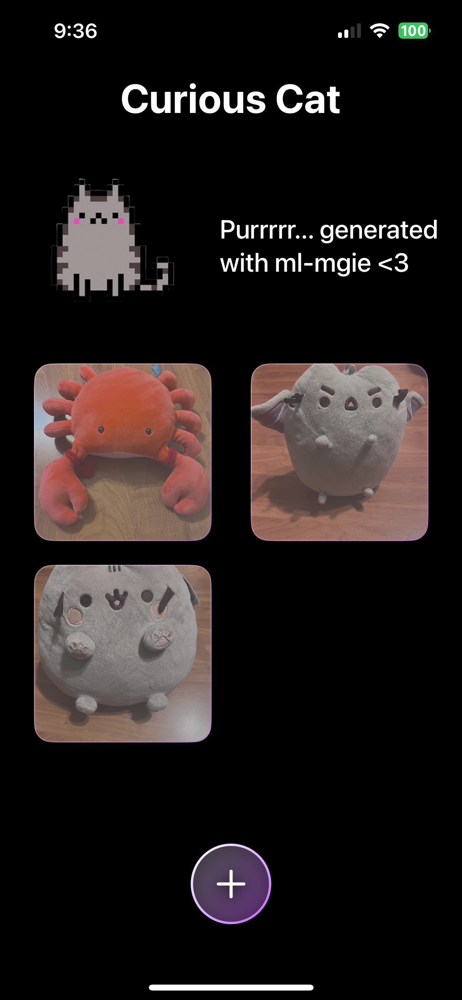

# Curious Cat

Curiousity kills the cat! The cat yaps but also want to know how your images can be changed through natural language.

## Technologies

- SwiftUI
- PhotosUI
- ml-mgie
- VisionKit (future)
- CoreML (future)
- ARKit (future)

## Features

- **Interactive Cat Images**: Users can browse through a variety of cat images, each paired with a creative prompt suggesting a playful modification to the image.
- **Image Gallery**: Users can see their creations.

## Demo

### Image 1



### Image 2


### Image 3


## Future Features

- **ml-mgie full Integration**: add a multi modal llm from Apple
- **Stickers**: make stickers from generated images
- **Animations**: make the cat more lively
- **AR Support**: make this compatible for AR/VR experiences

## Requirements

- iOS 14.0 or later
- Xcode 12.0 or later
- Swift 5

## Installation

To get started with Curious Cat, clone the repository to your local machine:

```
git clone https://github.com/bnleft/curious-cat.git
```

Navigate to the project directory and open `CuriousCat.xcodeproj` in Xcode:

```
cd curious-cat
open CuriousCat.xcodeproj
```

Run the project on your preferred simulator or real device by selecting the play button in Xcode.

## References

- [Apple Documentation](https://developer.apple.com/documentation/)
- [ml-mgie](https://ml-mgie.com)
